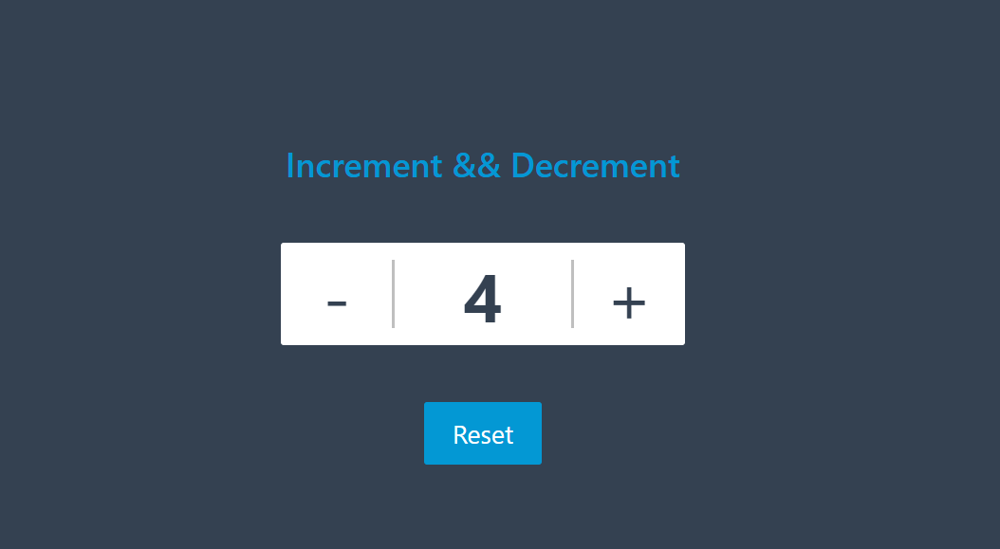

# increment - Decrement
***Simulation Link: https://increment-decrement-chi.vercel.app/***
## Overview

The Increment and Decrement project is a simple application designed to help you understand the basics of state management, event handling, and component structure in React.js. In this project, you'll create a basic counter that allows users to increase or decrease a numerical value displayed on the screen.

## Preview

